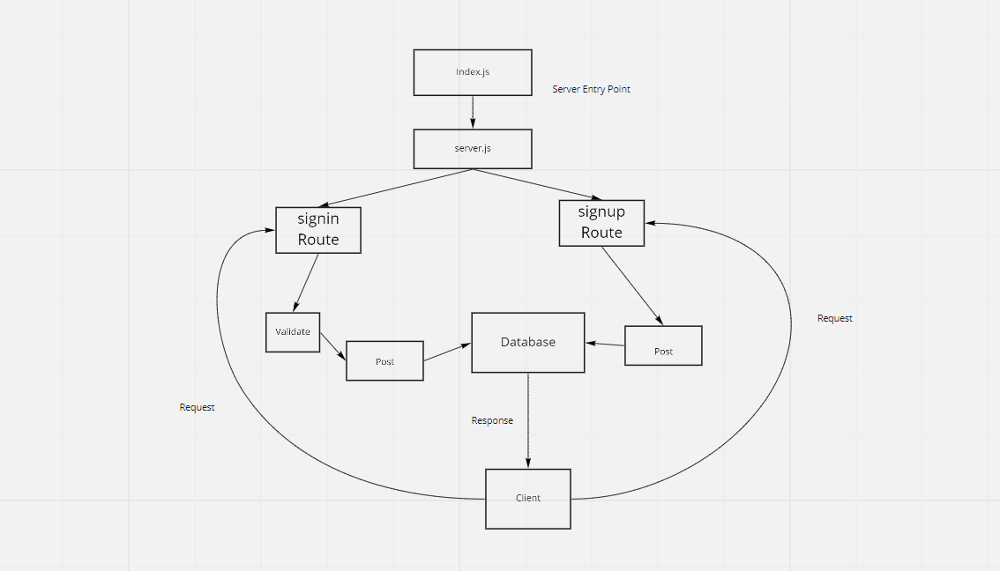

# basic-auth

Created by Anthony Morton

## Installation
Express, jest, dotenv, supertest, nodemon, pg, sequelize, sequelize-cli, sqlite3

## Summary of Problem Domain
Testing location / employee route through model. Testing Get, Put, Post, Delete from database

## Links to application deployment
signin: https://basic-auth-anthony-morton.herokuapp.com/signin
signup: https://basic-auth-anthony-morton.herokuapp.com/signup
pull request: https://github.com/anthonylouismorton/basic-auth/pull/1
actions: https://github.com/anthonylouismorton/basic-auth/actions

## Include embedded UML

## Talk about your routes

## Routes

* HTTP POST
  * Path: /Signin
    * validates user

    * HTTP POST
  * Path: /Signup
    * Creates new username/password in db
